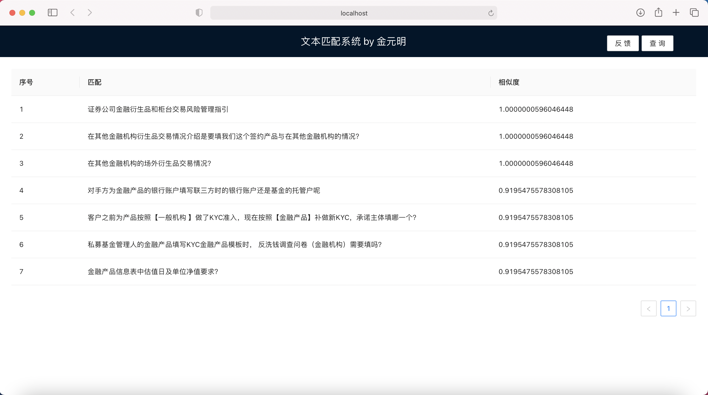
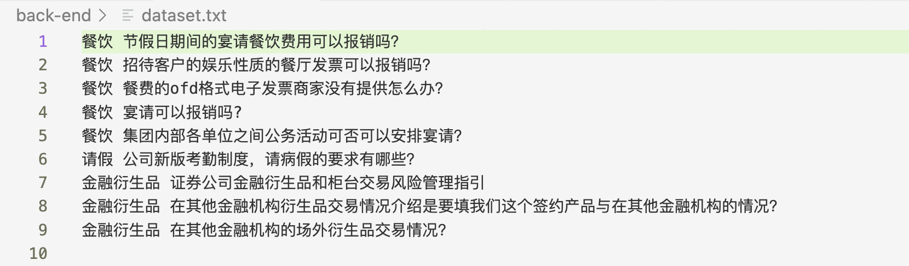

# 基于BERT的文本匹配系统

## 环境
- environment.yaml
- 使用sentence-transformers加载BERT，有三种预训练模型可以使用，包括
```python
BERT_MODEL1 = SentenceTransformer('distiluse-base-multilingual-cased')
BERT_MODEL2 = SentenceTransformer('paraphrase-multilingual-MiniLM-L12-v2')
BERT_MODEL3 = SentenceTransformer('paraphrase-multilingual-mpnet-base-v2')
```
- BERT_MODEL3测试效果最佳

## 更新：系统自我学习功能
- 在搜索界面右上角加入“反馈”功能，可以让用户选择本次搜索结果中，哪些搜索结果是比较准确的


- 点击“反馈”按钮，选择用户认为正确的反馈结果，后台将用户反馈结果记录至数据集dataset中


- 数据集中的数据储存格式为，每一行均为查询query和用户选择的正确反馈的文本对，待系统收集数据量充足时，可以对神经网络BERT模型的参数进行微调，达到BERT模型不断进行自我学习的功能

## 技术路线调研
- 对中文句子进行分词，输入相关词汇或句子，定位问题列表中的问题
- 技术路线调研
    - jieba库：Python中的优秀的中文分词第三方库。当输入一个query句子时，可以用jieba库进行分词，同时可以把excel中特殊关键词加入至jieba字典中
    - whoosh库：Python的全文检索库。可以配合jieba库搭建简单搜索引擎
    - fuzzywuzzy库：Python模糊字符串匹配库。可以计算两个字付出之间的edit distance
    - BERT：一个基于transformer的语言理解模型
- 思路
    - 本课题本质是一个字符串相似度匹配的问题
    - whoosh和fuzzywuzzy可以解决简单匹配问题，即出现过对应的关键字符串，可以检索到，但是对于“餐饮”匹配“宴请”则无法解决
    - BERT可以将输入的两个句子映射成向量，或映射至某一空间，然后计算余弦相似度，可以解决困难匹配问题，即需要“理解”的关键词
    - 目前初步打算采用两种方式结合的方法，首先jieba进行分词，然后先用whoosh或fuzzywuzzy进行硬匹配，如果问题里出现过关键词则直接取出，当硬匹配查找不到时，借助BERT等语言深度学习模型计算句子嵌入向量的余弦相似度，进行软匹配，最终返回top K相关的句子

## 语句相似度实验
- jieba
    - 对于文本匹配，可以采用直接对query和问题列表逐一进行相似度计算的方式，也可以先用jieba进行分词然后再利用分词结果进行匹配。后续相似度实验发现，直接用query进行匹配结果不准确，原因在于当任何一个句子较长时，对于句子中关键词的信息会越弱化，导致无法精准匹配，因此最终采用先分词后匹配的方式
    - 利用jieba库先对问题列表分词，再对query分词，然后进行进一步相似度计算的方式
- whoosh
    - whoosh适用于进行全文搜索，在长文里搜索效果也很好，速度快并且轻量级，但是不适合本课题，例如“餐饮”和“宴请”等具有同义的字符串，不能做到精准匹配，因此只适用于长文中的词语定位
- fuzzywuzzy
    - 字符串模糊匹配库，当query字符串是问题列表中字符串的子集时可以搜索出来，对于英文搜索更加友好，例如当搜索时拼写漏掉某个字母，仍然可以匹配到
    - 对于中文字符串来说，同样不能处理近义词问题。实验发现，“宴请”和“餐饮”fuzzy相似度为0，因此也不适用
- BERT
    - 对于近义词匹配，工程手段很难计算出较高的相似度，而深度学习模型可以将所有词或句子映射为文本空间的向量，然后通过向量计算余弦相似度，可以完美处理近义词问题。例如，“宴请”和“餐饮”具有0.748的余弦相似度
    - 但BERT对于非对称搜索效果欠佳，即query和问题列表中的问题可能长度差的比较多，此时难以匹配
    - 需要和jieba库同时使用，同时制定一套匹配策略
- 总结：由于存在近义词匹配问题（如“餐饮”和“宴请”），传统工程手段难以匹配这类近义词，因此需要转换为词向量形式，再进行进一步匹配以解决此难点

## 现使用方案
- 自己设计的匹配策略算法
    1. 直接匹配法
        - 直接将query和问题列表中的问题利用BERT全部计算特征向量，然后逐一求相似度
        - 简单并且容易实现，但不能解决非对称搜索问题，并且句子越长（包含信息越多），匹配效果越差
    2. 分词极大值匹配算法（当前使用）
        - 将query和问题列表中的问题全部进行精确分词，将全部分词送入BERT计算特征向量，找出query分词中和问题分词中相似度最大的一对向量，对应的相似度取平均值，即认为是query和问题的相似度
        - 设待查询文本分词后转换为的特征向量组为 $q_1, q_2, ..., q_m$，问题列表中某一问题分词后的特征向量组为 $s_1, s_2, ..., s_n$，则这对向量相似度定义为 
        $similarity(Q_x, S_y) = \frac{1}{m}\sum\limits_{i=1}^{m}\max\limits_{1\leq j\leq n} \{ cossim(q_i,s_j) \}$，
        最终问题列表中的全部问题都与query进行计算，返回相似度前k高的问题
        - 可以解决非对称搜索问题，但是当搜索词过于简短时（如“请假”）偶尔会出现匹配不准确问题，搜索词信息越多匹配越准
    3. 赋权分词极大值匹配算法
        - 针对分词极大值匹配算法的问题进一步改进，为query分词后的每一个词赋权，尝试使匹配结果更加精确。其中赋权采用TF-IDF（词频逆向文件频率）算法，用于信息挖掘与文本检索的常用技术
        - 设待查询文本分词后转换为的特征向量组为 $(w_1, q_1), (w_2, q_2), ..., (w_m, q_m)$，问题列表中某一问题分词后的特征向量组为 $(W_1, s_1), (W_2, s_2), ..., (W_n, s_n)$，则这对向量相似度定义为 
        $similarity(Q_x, S_y) = \frac{1}{m \times n}\sum\limits_{i=1}^{m}\sum\limits_{j=1}^{n} softmax(w_i) \times softmax(W_j) \times cossim(q_i,s_j)$，
        其中$w_{i,j}$为jieba分词赋权值，取softmax转换为概率分布，最终问题列表中的全部问题都与query进行计算，返回相似度前k高的问题
        - 由于jieba赋权更加关注某些名次和动词，权值不可控，导致效果比不赋权的更差。例如某个句子信息较多时，query可能与其中权重较低的某一词匹配，导致整体相似度分数低，因此不能很好的匹配。此外，BERT的区分度也可能与权重不匹配，导致检索不精确
- 前端实现
    - 主web界面大体与课题1相同，包含一张hardcode表格，表头包括序号、匹配问题、相似度。右上角查询按钮，点击可以输入搜索词，并发送给后端
    - 从后端接收返回的内容，展示在表格中
- 后端实现
    - 后端接收前端发送来的query，利用匹配策略算法逐一计算相似度，将前k个最高的准确度对应的问题返回给前端

## 匹配效果
- 某一问题的不同提问方式
- “餐饮报销”，“餐饮能报销吗？”，“餐饮，报销”
    1   节假日期间的宴请餐饮费用可以报销吗？	0.9999999701976776
    2	招待客户的娱乐性质的餐厅发票可以报销吗？	0.9692326188087463
    3	宴请可以报销吗?	0.8740195631980896
    4	报销发票最晚在招待宴请发生后多久开具？	0.8740195631980896
    5	请客户喝星巴克、喜茶等饮品可以报销吗？	0.8368612229824066
    6	出差的机票、住宿费用超标，可以报销吗？	0.8102149665355682
    7	餐费的ofd格式电子发票商家没有提供怎么办？	0.8043543994426727
    8	需要给客户设置一个追保最小金额，商品互换业务，需要联系谁？	0.8017339110374451
    9	出差往返机场、火车站的打车票、打车费用可以报销吗？	0.7998498976230621
    10	网约车、出租车费用报销的相关规定有哪些？	0.7998498976230621
- “餐饮怎么报销”
    1	节假日期间的宴请餐饮费用可以报销吗？	0.975144624710083
    2	招待客户的娱乐性质的餐厅发票可以报销吗？	0.9546330571174622
    3	宴请可以报销吗?	0.8911576867103577
    4	报销发票最晚在招待宴请发生后多久开具？	0.8911576867103577
    5	餐费的ofd格式电子发票商家没有提供怎么办？	0.8695695400238037
    6	请客户喝星巴克、喜茶等饮品可以报销吗？	0.8663854598999023
    7	网厅的个股报价，分红怎么处理？	0.8622698982556661
    8	资管产品通过收益凭证采购结构化产品的，给资管产品代销费用怎么划付？	0.8598875006039938
    9	银行账户开户行的大额支付号怎么填写？	0.8491150339444479
    10	出差的机票、住宿费用超标，可以报销吗？	0.8486212889353434
- “餐饮费用报销”
    1	节假日期间的宴请餐饮费用可以报销吗？	1.0000000596046448
    2	招待客户的娱乐性质的餐厅发票可以报销吗？	0.9330573479334513
    3	宴请可以报销吗?	0.8695819775263468
    4	报销发票最晚在招待宴请发生后多久开具？	0.8695819775263468
    5	出差往返机场、火车站的打车票、打车费用可以报销吗？	0.8665666778882345
    6	网约车、出租车费用报销的相关规定有哪些？	0.8665666778882345
    7	资管产品通过收益凭证采购结构化产品的，给资管产品代销费用怎么划付？	0.8598876396814982
    8	客户myeqd上的预付金流水无法查到按季度结算的费用，是什么原因？	0.8507855534553528
    9	请客户喝星巴克、喜茶等饮品可以报销吗？	0.8448097507158915
    10	需要给客户设置一个追保最小金额，商品互换业务，需要联系谁？	0.8278367519378662
- “餐饮发票”
    1	招待客户的娱乐性质的餐厅发票可以报销吗？	0.969232589006424
    2	节假日期间的宴请餐饮费用可以报销吗？	0.9254733920097351
    3	餐费的ofd格式电子发票商家没有提供怎么办？	0.8788810670375824
    4	报销发票最晚在招待宴请发生后多久开具？	0.8740196824073792
    5	宴请可以报销吗?	0.7994930744171143
    6	集团内部各单位之间公务活动可否可以安排宴请？	0.7715069055557251
    7	请问老客户补雪球材料，这里提到的【起草上传所需材料】和【CMS发签盖文件】分别是啥文件呀？	0.7665378451347351
    8	约券开仓后，网厅显示的券息发生调整，客户支付的券息是否会发生调整？	0.7659856379032135
    9	连续型指数增强收益凭证的分红时间表？	0.7655865848064423
    10	员工自行或通过差旅平台预定公务舱、航空公司柜台升舱、积分升舱等方式乘坐公务舱出行是否属于超标情况？	0.7651900947093964


